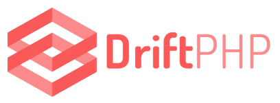

# DriftPHP Skeleton

Welcome to the skeleton of DriftPHP. In this small repository you will find an
extraordinary way of starting using DriftPHP and ReactPHP in your projects. Just
install it, load dependencies, and you will be ready to start building fast and
insane applications on top of Symfony and ReactPHP components.

<p align="center">
  
</p>

# Calls

First you need to start the server

```
php vendor/bin/server run 0.0.0.0:8000 --exchange=default

php bin/console websocket:run 0.0.0.0:1234 --exchange=default --route=events
```

Open the file `public/index.html` on your browser. After performing an update or delete action, you should see the changes reflected on both tables.

## GET

> curl -H "Content-Type: application/json" localhost:8000/users/{id}

## UPDATE

> curl -XPUT -H "Content-Type: application/json" localhost:8000/users/{id} -d'{"name": "Han Solo"}'

## DELETE

> curl -XDELETE -H "Content-Type: application/json" localhost:8000/users/{id} -d'{"name": "Han Solo"}'

# DATABASE

Create a database called `drift_users_api` and execute this SQL statement:

```sql
CREATE TABLE `users` (
  `id` bigint(20) unsigned NOT NULL AUTO_INCREMENT,
  `name` varchar(255) COLLATE utf8_unicode_ci DEFAULT NULL,
  PRIMARY KEY (`id`),
  UNIQUE KEY `id` (`id`)
) ENGINE=InnoDB DEFAULT CHARSET=utf8 COLLATE=utf8_unicode_ci;
```

Remember to modify the `Drift/config/services.yml` `dbal` section to configure your mySQL credentials.